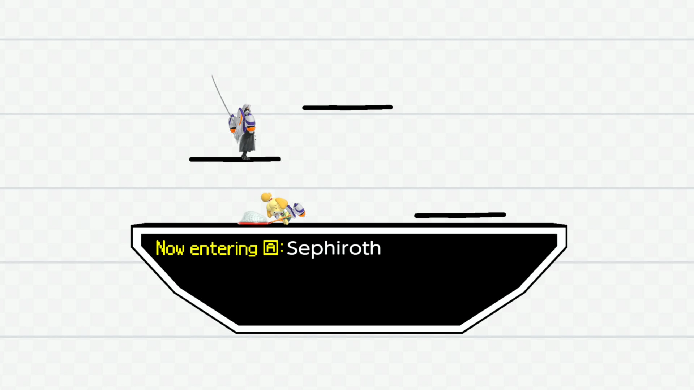
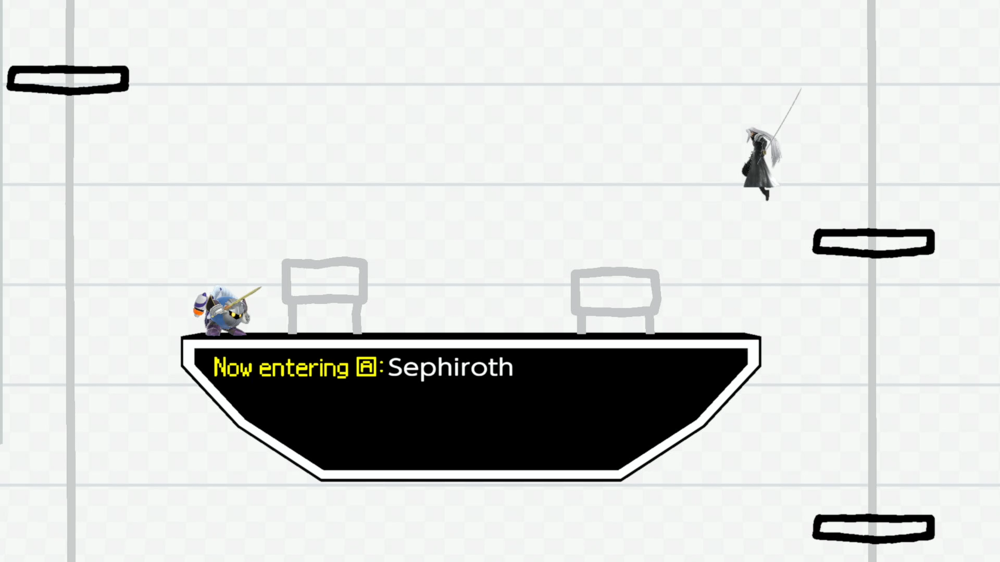

	<h2 class="section-heading text-uppercase">Pictochat</h2>

# Note to future pictochat modders
For the brave souls attempting to mod this stage: improper edits of numshb and numdlb files WILL cause your stage not to load. To avoid crashes:
- Make sure the meshes' names are the same as the source name (if you want a custom planeA mesh, make sure it is named `bone_005planeAShape` )
- I recommend not removing meshes, but instead either grey them out (use an HSV of 0,0,0.25 for vertex colors) and put them somewhat behind the stage (z of -35) to still show that a current scene is active. You can also flip the normals of most meshes and they'll turn invisible. You'll need at least one face present so that the mesh can write to file

### Stencil Animation
It seems that some combination of map1 and uvSet controls when a vertex gets drawn in. The motion file uses Vector31's X coordinate to create the drawing effect44. There is also an erasing animation, probably leave the material part of these motion files alone if possible? Not sure how to extend the duration of these animations.

For map1, the further the UV coordinate is to the right, the later it gets drawn.

### Scene Control
erase_wait controls when the scene ends. Most animations rely on the maximum being 1200 
Draw 1st is the wait range for the first rotation  
The last draw is the wait range after the first cycle finishes. By cycle, I mean 20 scenes have been played, it resets. Ya it's...kinda weird...

Stage scenes are in the order they appear in internal files. SNA: Should not attempt, probably make it another FD.

### TODO:
- Check to see if we can figure out stars?
### Might not be possible:
- Disable Stars
- Rework Noses
- Rework Boots
- Disable Pac Attack
- Figure out Sunset Collision

| # | Original | Notes | Change | New |
| :-: |:---:|:----:|:---:|:---:|
|0 | |  | Platforms that move up and down and wander around |  |
|1 | | Collision animation is most likely hardcoded? `0x1ae8d0ec87` refers to their wander range. `0x1e18f52878 and 0x1ecf1e9a39` might control time for each jump? | Turned noses into platforms. I would love them to move around randomly, but the jump contains hard coded collision so...it's gotta go :( |  |
|2 | | `0x0e97f09501` could refer to spawns, `0x185e7df818` to something? | NC |  |
|3 | | `0x22dfd9ae4b` could be barrel spawn time,  `0x134ab3b224` cam pos | (Sorry TNN, this gotta go) Warioware! |  |
|4 | | `0x141ed28149` the speed of pac1 , `0x1422dfbe10` speed of other pacs. Unsure about these, but: 0x17329e7064 onward deal with pac coordinates. 0x170ffe59d4 is x 0x141ed28149 is y  | Hardcoded collision, pacmen will spawn offscreen| |
|5 | | Plane spawn order is randomized| Fountain of Dreams (except middle platform also rises) |  |
| | | | |
| | | | |
|6 | | | Remove center box because of Cave of Life |  |
|7 | | Rigged hitbox and burybox. Motion handled internally? | hitboxes removed, not sure what to do with this | |
|8 | | `0x1b54f707a7 / 0x1a00b4c840` frame plats descend | Remain the same | |
|9 | | `0x1880339f33-0x18c216984e` cloud speed. A=middle. B=bottom. C=top. | One cloud removed, other cloud raised up |   |
|10 | | | Lowkey keep the same |  |
| | | | |
| | | | |
|11 | | `0x0d16ab9468` determines boundaries. Rigged electric hitbox; plats share model | Smashville but huge |   |
|12 | | Conveyor belt + LVD material change? | Water is brighter |  |
|13 | | Windbox? `0x164b50cfc7 / 0x1735f08633` correlate to left and right tornado power | Tornado greyed and inactive | |
|14 | | Windbox? `area_rect_info` | smaller gus, added platform |  |
|15 | | `0x156d69d853` could be restart timer | Removed heart/spark | |
| | | | |
| | | | |
|16 | | Each pipe has a skeleton attached to it. Could be used for something CRAZY... | Remove warp mechanic |  |
|17 | | | Hollow Bastion |  |
|18 | | Time delay likely tied to this. Position controlled via animation | Platforms come into the stage randomly |  |
|19 | | Conveyor Belt | BF |  |
|20 | | clock controls position of hands. Clock can spawn on the left or right. Might be controlled by bin files, same with rotation. `0x17c9f8dcb6` controls how long this lasts. `0x19b99af1fd` speed of drawing? | Not sure how to control the spawn so we're removing it |  |
| | | | |
| | | | |
|21 | | Hardcoded collision | Nothing can be done about this :( |  |
|22 | | Chooses a random set of platforms to be active | Walls |  |
|23 | | `0x15d3a58fe2` start time. Writes one line, dabs ink, writes the next line. Lines appear in random? spots disappear eventually. `0x17d8af066b` should refer to this. | | |
| | | | |
| | | | |
|24 |   | Background for the last 3. This scene can also load on its own without any of the next 3 gimmicks. Only one of these four scenes will load per cycle. | Background is lighter to accommodate GnW,C4,Enderman |  |
|25 | | Hardcoded collision (but WHY). Params start at `0x1a796fa1b0`? `0x1518a1ffbc` star angle. `0x253d141992` control when to split into two stars. | attempting to remove stars | | |
|26 | | `0x186ce6a6ec` scene length. `0x1f0bc8f27d` has some influence on blackout effect | Remove final dark phase | |
|27 | | | removed hitboxes/watchmen | |